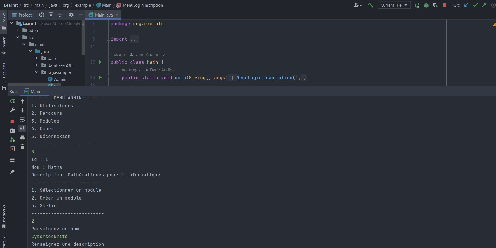

# LearnIt

Ce projet a été réalisé en cours de formation, en équipe grâce à la méthode Agile. Le gestionnaire de versions décentralisé Git a été indispensable.Cette application sur console a été développé en Java avec MySQL comme SGBD. Des niveaux d'habilitation permettent un accès restreint et sécurisé aux données.

Ce dépôt est une copie de l'original.

## Auteurs

Equipe de 5 étudiants en SIO SLAM 2ème année.

Dont : Beatriz Moura | @BeaMoura0906